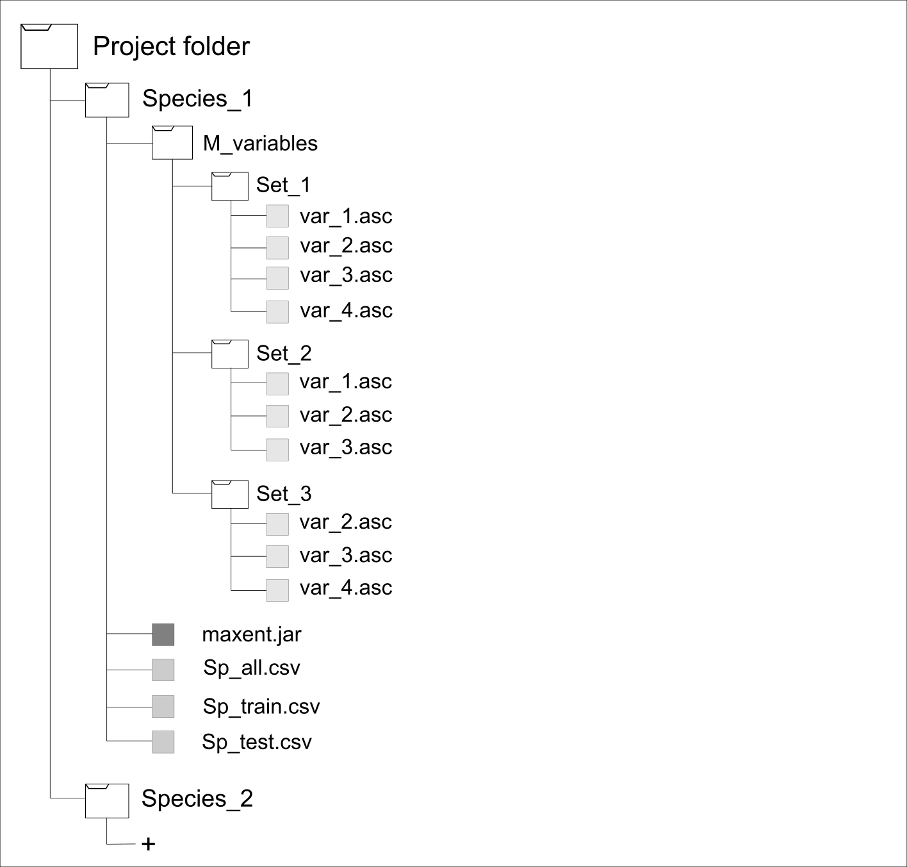
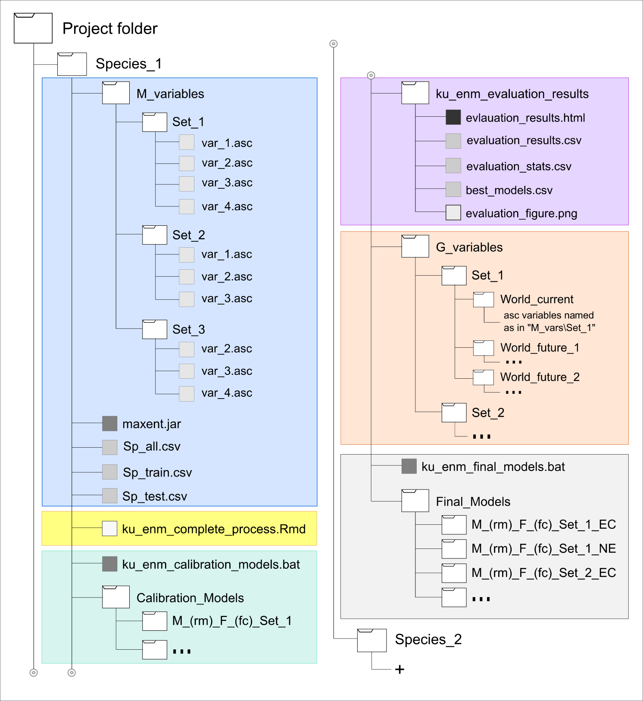

ku.enm vignette
================
Marlon E. Cobos and A. Townsend Peterson
March 15, 2018

-   [Introduction](#introduction)
-   [Getting started](#getting-started)
    -   [Directory structure and necessary data](#directory-structure-and-necessary-data)
    -   [Bringing functions to the R environment](#bringing-functions-to-the-r-environment)
    -   [Example data](#example-data)
-   [Doing the analyses](#doing-the-analyses)
    -   [Making analyses more reproducible](#making-analyses-more-reproducible)
    -   [Calibration models](#calibration-models)
    -   [Evaluation and selection of best models](#evaluation-and-selection-of-best-models)
    -   [Final models creation](#final-models-creation)

<br>

Introduction
------------

**ku.enm** is an R package designed to make the process of model calibration and final model creation easier and reproducible, but at the same time more robust. The main aim of this package is to perform detailed calibrations of Maxent models to select the best parametrizations for each study. Another objective of this program is to make the task of creating final models and their projections easier.

This is a brief tutorial for using the functions of the **ku.enm** R package. An example of a disease vector is used in this tutorial to make it more reliable. Since the package is still under development, functions help can be checked while performing the processes.

<br>

Getting started
---------------

### Directory structure and necessary data

Since this package was designed to perform multiple analyses avoiding excessive demands from the computer (especially related to ram memory used for R), it needs certain data and organization in the working directory. Following this structure (Fig.1) will allow working with one or more species in a project and avoid potential problems during the analyses.

Before starting the analyses make sure your working directory has the following components:

-   A folder containing the distinct sets of environmental variables (i.e., M\_variables in Figure 1) that are going to be used (more than one recommended but not mandatory). These variables must represent the area in which your models are going to be calibrated.
-   The maxent.jar application, available at <a href="https://biodiversityinformatics.amnh.org/open_source/maxent/" target="_blank">Maxent repository</a>.
-   A csv file containing all the species occurrences (preferably after cleaning and thinning original data to avoid problems like wrong records or spatial auto-correlation).
-   A csv file containing species occurrences for training models. For obtaining this and the next files the complete set of records must be divided. Occurrences partition can be done in multiple ways, but independence of training and testing data is desired.
-   A csv file containing species occurrences for testing models.

<br>



Figure 1. Directory structure and necessary data for getting started with the ku.enm R package.

<br>

### Bringing functions to the R environment

**ku.enm** functions are available in a GitHub repository and can be acceded using the following codes.

``` r
source("https://raw.githubusercontent.com/manubio13/ku.enm/master/Functions/ku.enm.start.R")
source("https://raw.githubusercontent.com/manubio13/ku.enm/master/Functions/ku.enm.cal.R")
source("https://raw.githubusercontent.com/manubio13/ku.enm/master/Functions/ku.enm.eval.R")
source("https://raw.githubusercontent.com/manubio13/ku.enm/master/Functions/ku.enm.mod.R")
```

<br>

### Example data

Data used as example for testing this package correspond to the turkey tick *Amblyomma americanum*, a vector of various diseases including human monocytotropic ehrlichiosis, canine and human granulocytic ehrlichiosis, tularemia, and southern tick-associated rash illness. This species is distributed in North America and a complete analysis of the risk of its invasion to other areas is being studied in Raghavan et al. (in prep.).

These data is already structured as needed for doing the analyses with this package, and can be obtained at <a href="https://github.com/manubio13/ku.enm/tree/master/Project_folder/Species_1" target="_blank">Example data in GitHub</a>. If this is part of a course, these data will be provided to you in a .zip file.

Your working directory (e.g., Project folder) will be structured similar to what is presented in Figure 1.

<br>

Doing the analyses
------------------

### Making analyses more reproducible

Once the working directory and data are ready, the function *ku.enm.start* (.Rmd) will allow to generate an *R Markdown* file as a guide to perform all the analyses that this package includes. By recording all the code chunks that are going to be used during the modeling process this file also helps to make it more reproducible. This file will be written in the working directory.

The only argument for the *ku.enm.start* function is file.name, it is the name of the markdown file that will be created for guiding and recording all your codes.

``` r
#Preparing variables to be used as arguments
file_name = "ku_enm_complete_process"
```

``` r
#Starting analyses
ku.enm.start(file.name = file_name)
```

<br>

### Calibration models

Notice that from this point, the following procedures will be performed in the *R Markdown* file previously created, but only if the *ku.enm.start* function was used.

The function *ku.enm.cal* creates and executes a batch file for generating maxent calibration models that will be written in sub-directories, named as the parametrizations selected, inside the output directory (Fig. 2 green area). Calibration models will be created with multiple combinations of regularization multipliers, feature classes, and sets of environmental predictors. For each combination this function creates one maxent model with the complete set of occurrences and another with training occurrences only. In some computers the user will be asked if ruining the batch file before starting the modeling process in Maxent.

Maxent will run in command-line interface (**do not close this application**) and its graphic interface will not show up to avoid interfering activities other than the modeling process.

``` r
#Variables with information to be used as arguments
occ_all <- "Sp_all.csv"
occ_tra <- "Sp_cal.csv"
M_var_dir <- "M_vars"
batch_cal <- "ku_enm_calibration_models"
cal_dir <- "Calibration_Models"
reg_mul <- c(seq(0.1,1,0.1),seq(2,6,1),8,10,15,20)
```

``` r
ku.enm.cal(occ.all = occ_all, occ.tra = occ_tra, M.var.dir = M_var_dir, batch = batch_cal,
           out.dir = cal_dir, reg.mult = reg_mul, f.clas = "all")
```

<br>

### Evaluation and selection of best models

The function *ku.enm.eval* evaluates models performance based on significance (partial ROC), omission rates (E = 5%), and complexity (AICc), and selects best models based on distinct criteria ("OR\_AICc", "AICc", or "OR"; OR = omission rates). Partial ROC and omission rates are evaluated on models created with training occurrences, and AICc values are calculated on models created with the full set of occurrences. The outputs will be stored in a folder that will contain: a *CSV* file with the statistics of models meeting various criteria, another with only the selected models based on the chosen criteria, a third one with the performance metrics for all calibration models, a plot *PNG* of the models performance based on the analysed metrics, and an *HTML* file reporting all the results of the model evaluation and selection process designed to guide further interpretations (Fig. 2 purple area).

``` r
#Variables with information to be used as arguments
occ_test <- "Sp_eval.csv"
out_eval <- "ku_enm_evaluation_results"
```

``` r
ku.enm.eval(path = cal_dir, occ.all = occ_all, occ.tra = occ_tra, occ.test = occ_test, batch = batch_cal,
            out.eval = out_eval, omi.val = 5, rand.perc = 50, no.inter = 1000, kept = TRUE, selection = "OR_AICc")
```

Now take a look of your evaluation results in the *HTML* file.

<br>

### Final models creation

After selecting parametrizations producing the best models, the next step is creating the final models and, if needed, project them to other areas or scenarios. The *ku.enm.mod* function takes the *CSV* file with the best models chosen after model selection, and writes and executes an batch file for creating final models with the selected parametrizations. Models and projections will be stored in subdirectories inside an output folder and these subdirectories will be named similar to how they are named when calibration models are created. By allowing projections (i.e., project = TRUE) and defining the folder in which scenarios for transfers are (i.e., folder name in G.var.dir argument), this function will automatically perform those transfers.

Maxent will run in command-line interface like when creating calibration models (**again, do not close this application**). However, take into account that creating final models may take considerably more time, especially when projecting, because it will be executing other processes not performed during calibration (e.g., Jackknife analyses, response curves, etc.).

``` r
#Variables with information to be used as arguments
mod_dir <- "Final_Models"
G_var_dir <- "G_variables"
##Most of the variables used here as arguments were already created for the previous function
```

``` r
ku.enm.mod(occ.all = occ_all, M.var.dir = M_var_dir, out.eval = out_eval, rep.n = 10, rep.type = "Bootstrap", 
           out.dir = mod_dir, out.format = "logistic", project = TRUE, G.var.dir = G_var_dir, 
           ext.type = "all", write.mess = FALSE, write.clamp = FALSE)
```

<br>

At the end of your process you working directory will have the structure and data presented below.



Figure 2. Directory structure and data after performing the analyses with the ku.enm R package. Background colors represent necessary data before starting the analyses (blue) and data generated after using the start function (yellow), creating calibration models (green), evaluating calibration models (purple), preparing projection layers (orange), and generating final models and its projections (light grey).
